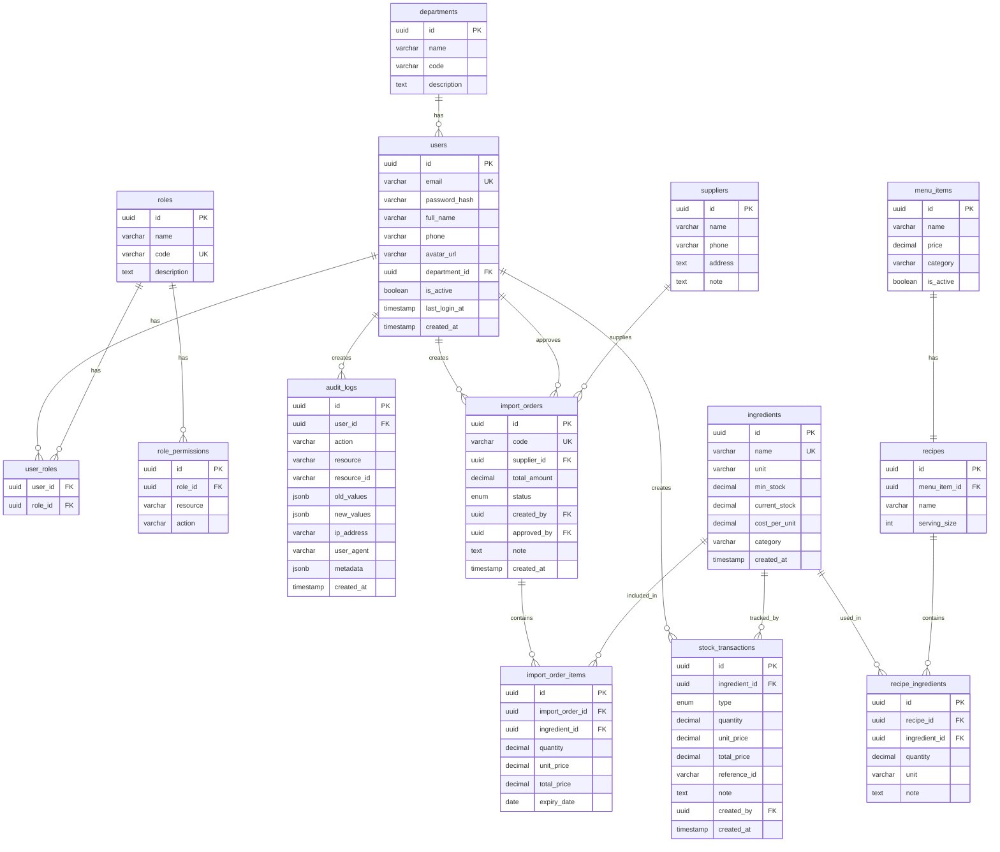

# Entity Relationship Diagram

## Hệ Thống Quản Lý Kho Nguyên Liệu

---

## Diagram (Mermaid)

---

## Relationships Summary

| From | To | Relationship | Mô tả |
|------|----|-------------|--------|
| departments | users | 1:N | 1 bộ phận có nhiều user |
| users | user_roles | 1:N | 1 user có nhiều role |
| roles | user_roles | 1:N | 1 role gán cho nhiều user |
| roles | role_permissions | 1:N | 1 role có nhiều permission |
| users | audit_logs | 1:N | 1 user có nhiều log |
| users | import_orders | 1:N | 1 user tạo nhiều phiếu |
| suppliers | import_orders | 1:N | 1 NCC có nhiều phiếu nhập |
| import_orders | import_order_items | 1:N | 1 phiếu có nhiều dòng |
| ingredients | import_order_items | 1:N | 1 NL xuất hiện nhiều phiếu |
| ingredients | stock_transactions | 1:N | 1 NL có nhiều giao dịch |
| ingredients | recipe_ingredients | 1:N | 1 NL dùng trong nhiều recipe |
| menu_items | recipes | 1:1 | 1 món có 1 công thức |
| recipes | recipe_ingredients | 1:N | 1 công thức có nhiều NL |
